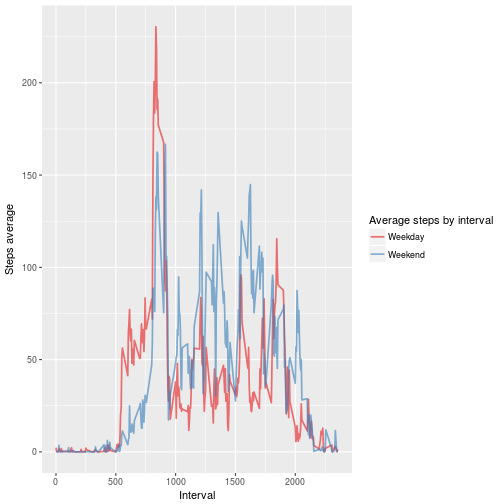

## Course project 1 from the Reproductible Research course, as a part of the\n
 Data Science specialization from Coursera and Johns Hopkins University.

The base dataset is the [Activity monitoring data](https://d396qusza40orc.cloudfront.net/repdata%2Fdata%2Factivity.zip).

## 1. Reading data

Setting echo and cache to TRUE:

```r
knitr::opts_chunk$set(echo = TRUE, cache = TRUE)
```

Loading the required packages and reading activity.csv dataset:

```r
library(dplyr, quietly = TRUE)
library(ggplot2)
unzip("./activity.zip")
act <- read.csv("./activity.csv", header = TRUE)
```

## 2. What is mean total number of steps taken per day?
Grouping the data by date and creating a column with the sum of the daily steps:

```r
act$date <- as.factor(act$date)
act_sum <- group_by(act, date) %>% summarise(total_steps = sum(steps))
steps_sum <- act_sum$total_steps
```
In general, steps_sum looks like this:

```r
summary(steps_sum)
```

```
##    Min. 1st Qu.  Median    Mean 3rd Qu.    Max.    NA's 
##      41    8841   10760   10770   13290   21190       8
```
Plotting the histogram of the steps per day:

```r
hist(steps_sum, ylim = c(0,30), xlab = "Total steps per day", col = "gray",
     main = "Total steps per interval (without NA filling)")
rug(steps_sum)
abline(v = mean(steps_sum, na.rm = TRUE), lwd = 3, col = "red")
abline(v = median(steps_sum, na.rm = TRUE), lty = 4, lwd = 2)
legend("topright", legend = c("Average steps", "Median of steps"), cex = .8,
       lty = c(1,4), lwd = c(3,2), col = c("red","black"))
```


## 3. Calculate and report the mean and median of the total number of steps taken per day.

* Mean:

```r
mean(steps_sum, na.rm = TRUE)
```

```
## [1] 10766.19
```
* Median:

```r
median(steps_sum, na.rm = TRUE)
```

```
## [1] 10765
```

## 4. What is the average daily activity pattern?
Grouping the data by interval, creating a new column with the average of steps;
and plotting it:

```r
act_mean <- group_by(act, interval) %>% summarise(mean_steps = mean(steps, na.rm = TRUE))

with(act_mean, plot(interval, mean_steps, type = "l", col = "blue", 
     xlab = "Interval index", ylab = "Average steps", main = "Average steps per interval"))
```


## 5. Which 5-minute interval, on average across all the days in the dataset, \n
contains the maximum number of steps?

```r
maxStepInd <- which.max(act_mean$mean_steps)
maxStepVal <- round(max(act_mean$mean_steps),1)
```
The maximum number of steps is **206.2**, and occurrs in the **104th** interval.

## 6. Calculate and report the total number of missing values in the dataset (i.e.
the total number of rows with NAs)

```r
cases <- table(complete.cases(act))
barplot(cases, names.arg = c("Missing values", "Non-missing values"), 
        cex.axis = .7, main = "NA and complete cases")
text(c(.7,1.9), cases-700, labels = cases)
```


Devise a strategy for filling in all of the missing values in the dataset.
Filling NA's with the mean value for the given interval:

```r
posNA <- which(is.na(act$steps)) # Positions with NA values
actNA <- act[posNA, ] %>% left_join(act_mean, by = "interval")
new_act <- act
new_act[posNA, 1] <- actNA$mean_steps
```

## 7. What is the impact of imputing missing data on the estimates of the total \n
daily number of steps?
Grouping by date and summarising the data, creating a new column with total steps:

```r
new_act_sum  <- group_by(new_act, date) %>% summarise(new_total_steps = sum(steps)) 
new_steps_sum <- new_act_sum$new_total_steps
```

Now it is possible to compare new_steps_sum and steps_sum (in which the NA were not removed)
and see the changes in the median and mean between the two data:

```r
summary(new_steps_sum)
```

```
##    Min. 1st Qu.  Median    Mean 3rd Qu.    Max. 
##      41    9819   10770   10770   12810   21190
```

```r
summary(steps_sum)
```

```
##    Min. 1st Qu.  Median    Mean 3rd Qu.    Max.    NA's 
##      41    8841   10760   10770   13290   21190       8
```

Comparing the histograms without and with NA filling: 

```r
par(mfrow = c(1, 2))

# Without NA filling
hist(steps_sum, ylim = c(0,40), xlab = "Steps", col = "gray",
     main = "Total steps per interval 
     (without NA filling)")
rug(steps_sum)
abline(v = mean(steps_sum, na.rm = TRUE), lwd = 3, col = "red")
abline(v = median(steps_sum, na.rm = TRUE), lty = 4, lwd = 2)
legend("topright", legend = c("Average steps", "Median of steps"), cex = .6,
       lty = c(1,4), lwd = c(3,2), col = c("red","black"))

# With NA filling
hist(new_steps_sum, ylim = c(0,40), xlab = "Steps", col = "gray", 
     main = "Total steps per interval 
     (with NA filling)")
rug(new_steps_sum)
abline(v = mean(new_steps_sum), lwd = 3, col = "red")
abline(v = median(new_steps_sum), lty = 4, lwd = 2)
legend("topright", legend = c("Average steps", "Median of steps"), cex = .6,
       lty = c(1,4), lwd = c(3,2), col = c("red","black"))
```


## 8. Are there differences in activity patterns between weekdays and weekends?
Taking the "date" column from the data with NA filling and distinguishing 
weekday from weekend:

```r
week <- weekdays(as.Date(new_act$date))
week <- factor(gsub("[^(Sat|Sun)].*", "weekday", week))
week <- factor(gsub("S.*", "weekend", week))

new_act <- cbind(new_act, week) %>% group_by(interval, week) %>% 
    summarise(mean_steps = mean(steps))
```

Plotting the average steps per interval, considering weekend and weekday:

```r
ggplot(data = new_act, aes(interval, mean_steps, col = week)) +
    geom_line(alpha = .6, lwd = .8) +
    labs(x = "Interval", y = "Steps average") +
    scale_color_brewer(palette = "Set1", name = "Average steps by interval", 
                       labels = c("Weekday", "Weekend"))
```


